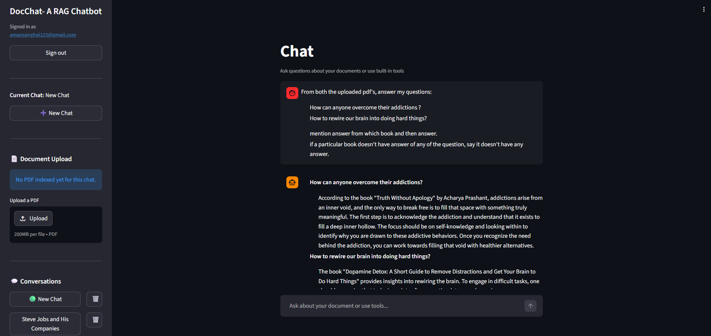
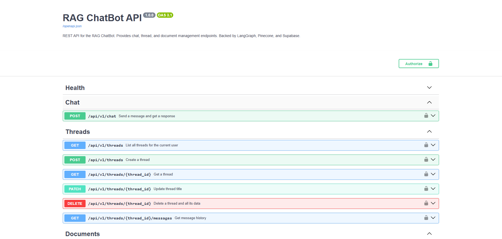

# RAG ChatBot

> **An AI-powered, multi-user Retrieval-Augmented Generation chatbot built with LangGraph, FastAPI, Pinecone, and Supabase.**

Upload a PDF, ask questions about it, or use built-in tools like web search, stock prices, and a calculator — all in a single conversation thread that persists across sessions.

---

## Overview

This project started as a Streamlit + LangGraph prototype and was progressively hardened into a production-ready backend:

| Layer | Technology |
|---|---|
| Frontend | Streamlit (chat UI, PDF upload, conversation history) |
| API | FastAPI (REST, Swagger/ReDoc, JWT auth) |
| Orchestration | LangGraph (stateful agent graph with tool routing) |
| Vector Store | Pinecone (thread-namespaced similarity search) |
| Database | Supabase PostgreSQL (threads, messages, documents, checkpoints) |
| LLM | OpenAI GPT-4o-mini + text-embedding-3-small |
| Authentication | Supabase Auth (ES256 JWT, JWKS public-key verification) |

**What it does:**

- Users sign in via Supabase Auth and receive a JWT
- They create conversation threads and optionally upload a PDF to each thread
- At every turn, LangGraph decides whether to answer from the PDF (RAG), call a web search, run a calculation, or fetch a stock price
- All state — messages, threads, and conversation checkpoints — persists in Supabase PostgreSQL
- The REST API enforces per-user data isolation: every query is scoped to the authenticated user's ID

---

## Features

### Implemented

- **PDF-based RAG** — Upload a PDF; the chatbot retrieves relevant passages using Pinecone similarity search (k=4, top chunks)
- **LangGraph agent graph** — Stateful graph with a chat node and a tool node connected by conditional routing
- **Conversation memory** — LangGraph PostgresSaver checkpointer stores full message history in Supabase; conversations resume correctly after restart
- **Thread management** — Create, list, rename, and delete conversation threads via the API or the Streamlit UI
- **AI-generated thread titles** — On the first message, GPT-4o-mini generates a concise 3–6 word title automatically
- **Built-in tools** — Web search (DuckDuckGo), stock price lookup (Alpha Vantage), calculator
- **Multi-user isolation** — Every DB query is scoped by `user_id`; users cannot read or modify each other's threads
- **JWT authentication** — ES256 tokens issued by Supabase, verified via JWKS public-key endpoint (no shared secret)
- **Row Level Security** — RLS policies on threads, messages, and documents as a defence-in-depth layer
- **Document deduplication** — Re-uploading the same filename to the same thread is a no-op (deterministic Pinecone vector IDs)
- **FastAPI REST API** — Full CRUD for threads and documents, chat endpoint, Swagger UI at `/docs`, ReDoc at `/redoc`
- **Request logging middleware** — Every request logged with a short request ID, method, path, status code, and latency
- **Structured error handling** — Consistent JSON error responses for 401, 404, 415, 422, 500 via a central handler registry
- **Comprehensive test suite** — 25 tests covering health, threads, chat, documents, and auth; service layer mocked so no real Supabase/LangGraph/OpenAI calls are needed
- **Streamlit authentication UI** — Full login and signup forms with email/password; session stored in `st.session_state`; all chat history persists across logout/login via Supabase
- **Docker packaging** — Multi-stage `Dockerfile` (python:3.13-slim, non-root user) + `docker-compose.yml` running FastAPI and Streamlit as separate services on a shared `.env` and volume

### Planned / Future Work

- Streaming API responses (SSE / WebSocket) — Streamlit already streams via LangGraph; the FastAPI `/chat` endpoint currently returns a full response
- AWS deployment (ECS or App Runner)
- React/Next.js web frontend to replace Streamlit
- Rate limiting per user
- Structured observability (metrics, traces)
- RAG evaluation pipeline (relevance scoring, hallucination detection)

---

## Tech Stack

| Category | Tool | Purpose |
|---|---|---|
| Frontend | Streamlit | Chat UI, sidebar, PDF upload |
| API framework | FastAPI 0.111+ | REST endpoints, dependency injection |
| API server | Uvicorn | ASGI server |
| Orchestration | LangGraph 0.2+ | Agent graph, conditional tool routing |
| LLM | OpenAI GPT-4o-mini | Chat responses, title generation |
| Embeddings | OpenAI text-embedding-3-small | PDF chunk embeddings (1536-dim) |
| Vector DB | Pinecone (Serverless) | Per-thread namespaced similarity search |
| Database | Supabase PostgreSQL | Threads, messages, documents, LangGraph checkpoints |
| Auth | Supabase Auth + PyJWT | ES256 JWT issuance + JWKS verification |
| HTTP client | Supabase Python SDK | Supabase table operations |
| PDF loading | PyPDFLoader + RecursiveCharacterTextSplitter | Document ingestion |
| Testing | pytest + FastAPI TestClient | Unit + integration tests (mocked services) |
| Validation | Pydantic v2 | Request/response schema validation |

---

## System Architecture

### Overall Architecture

```
┌─────────────────────────────────────────────────────────┐
│                       Client                            │
│   Streamlit UI  ──────────────  Browser / Swagger UI    │
└────────┬──────────────────────────────┬─────────────────┘
         │ direct Python import          │ HTTP + Bearer JWT
         ▼                               ▼
┌─────────────────────┐       ┌──────────────────────────┐
│  langgraph_rag_     │       │     FastAPI (app/)        │
│  backend.py         │       │                          │
│                     │       │  /health                 │
│  LangGraph Graph:   │       │  /api/v1/chat            │
│  chat_node ──► tools│◄──────│  /api/v1/threads         │
│       ▲             │       │  /api/v1/threads/{id}/   │
│       │ invoke()    │       │    messages & documents   │
└───┬───┴─────────────┘       └──────────┬───────────────┘
    │                                     │
    │    ┌────────────────────────────────┤
    │    │                               │
    ▼    ▼                               ▼
┌──────────────┐              ┌──────────────────────────┐
│   Pinecone   │              │  Supabase PostgreSQL      │
│              │              │                          │
│ Namespace =  │              │  threads (user_id FK)    │
│  thread_id   │              │  messages                │
│              │              │  documents               │
│ Similarity   │              │  checkpoints (LangGraph) │
│ search k=4   │              │  checkpoint_blobs        │
└──────────────┘              │  checkpoint_writes       │
                              └──────────────────────────┘
```

### Authentication Flow

```
Client                  FastAPI                  Supabase
  │                       │                         │
  │── POST /auth/v1/token ──────────────────────────►│
  │◄── { access_token: "eyJ..." (ES256 JWT) } ───────│
  │                       │                         │
  │── GET /api/v1/threads ►│                         │
  │   Authorization:       │                         │
  │   Bearer eyJ...        │                         │
  │                       │── GET /auth/v1/.well-   │
  │                       │   known/jwks.json ──────►│
  │                       │◄── { keys: [EC pub key] }│
  │                       │                         │
  │                       │  Verify ES256 signature  │
  │                       │  Extract sub (user_id)   │
  │                       │  Scope query by user_id  │
  │◄── 200 [threads] ──────│                         │
```

Note: The JWKS response is cached in memory at startup — only one network call is made per server process.

### RAG Pipeline (Document Query Flow)

```
User message
     │
     ▼
LangGraph chat_node
     │
     │── LLM decides: use rag_tool? ──► rag_tool(query, thread_id)
     │                                        │
     │                                        ▼
     │                               Pinecone similarity search
     │                               namespace = thread_id
     │                               k = 4 top chunks
     │                                        │
     │◄── retrieved context ──────────────────┘
     │
     │── LLM synthesises final answer using retrieved passages
     │
     ▼
AI response → saved to Supabase messages table
```

### PDF Ingestion Flow

```
PDF bytes (from upload)
     │
     ▼
PyPDFLoader → load pages
     │
     ▼
RecursiveCharacterTextSplitter
  chunk_size=1000, overlap=200
     │
     ▼
Generate deterministic chunk IDs
  format: {thread_id}:{filename}:p{page}:c{idx}
     │
     ▼
OpenAI text-embedding-3-small
  embed each chunk (1536-dim)
     │
     ▼
Pinecone batch upsert (100 chunks/batch)
  namespace = thread_id
     │
     ▼
Cache retriever in _THREAD_RETRIEVERS[thread_id]
     │
     ▼
Save document metadata to Supabase documents table
```

---

## Project Structure

```
RAG_ChatBot_1/
│
├── app/                          # FastAPI application package
│   ├── main.py                   # App factory: routes, middleware, lifespan
│   ├── api/
│   │   └── routes/
│   │       ├── health.py         # GET /health  (public, no auth)
│   │       ├── threads.py        # CRUD for conversation threads
│   │       ├── chat.py           # POST /api/v1/chat
│   │       └── documents.py      # PDF upload + document listing
│   ├── core/
│   │   ├── auth.py               # JWT verification (ES256 + JWKS)
│   │   ├── config.py             # Environment variable settings
│   │   ├── exceptions.py         # Custom exceptions + central handler registry
│   │   ├── lifespan.py           # Startup/shutdown (JWKS warmup, backend warmup)
│   │   └── middleware.py         # Request logging middleware (X-Request-ID)
│   ├── models/
│   │   └── schemas.py            # Pydantic v2 request/response models
│   └── services/
│       ├── thread_service.py     # Thread business logic (wraps db_service)
│       ├── chat_service.py       # invoke_chat wrapper around LangGraph
│       └── document_service.py   # PDF upload + Pinecone ingestion orchestration
│
├── langgraph_rag_backend.py      # Core LangGraph agent: graph, tools, checkpointer
├── frontend_rag.py               # Streamlit chat UI with login/signup auth gate
├── db_service.py                 # All Supabase table operations (thin CRUD layer)
├── supabase_client.py            # Supabase client singleton
│
├── migrations/
│   └── 001_add_user_id_to_threads.sql  # Adds user_id + RLS policies
│
├── tests/
│   ├── conftest.py               # Session-scoped TestClient + auth override
│   ├── test_health.py            # Health endpoint tests
│   ├── test_threads.py           # Thread CRUD tests
│   ├── test_chat.py              # Chat endpoint tests (mocked LangGraph)
│   ├── test_auth.py              # Auth tests (real JWT validation, no mocks)
│   └── __init__.py
│
├── Dockerfile                    # Multi-stage build: deps → runtime (non-root user)
├── docker-compose.yml            # FastAPI + Streamlit services, shared .env + volume
├── .dockerignore                 # Excludes .env, __pycache__, venv, uploads from context
├── AUTH_ARCHITECTURE.md          # End-to-end auth system documentation (learning reference)
├── debug_token.py                # Dev utility: verify a Supabase JWT against JWKS
├── migrate_existing_threads.py   # One-time migration helper
├── requirements.txt
├── .env.example                  # Safe template — copy to .env and fill in secrets
├── .gitignore
├── uploads/                      # Temp storage directory (kept by .gitkeep)
└── .env                          # Local secrets (never committed)
```

---

## Installation

### Prerequisites

- Python 3.11+
- A [Supabase](https://supabase.com) project (free tier works)
- A [Pinecone](https://www.pinecone.io) account with a serverless index (1536 dimensions)
- An [OpenAI](https://platform.openai.com) API key

### 1. Clone the repository

```bash
git clone <your-repo-url>
cd RAG_ChatBot_1
```

### 2. Create a virtual environment

```bash
# Windows
python -m venv venv
venv\Scripts\activate

# macOS / Linux
python -m venv venv
source venv/bin/activate
```

### 3. Install dependencies

```bash
pip install -r requirements.txt
```

### 4. Configure environment variables

Copy the example below to a `.env` file in the project root and fill in your values:

```env
# OpenAI
OPENAI_API_KEY=sk-...

# Pinecone
PINECONE_API_KEY=pcsk_...
PINECONE_INDEX_NAME=rag-chatbot

# Supabase — application tables (anon key for reads, service role for writes)
SUPABASE_URL=https://<project-ref>.supabase.co
SUPABASE_KEY=eyJ...   # service role key (bypasses RLS)

# Supabase — PostgreSQL connection (for LangGraph checkpointer)
# Local dev: use the direct connection from Dashboard → Settings → Database
# Docker on Windows/Linux: use the Session Pooler URL (resolves to IPv4)
DATABASE_URL=postgresql://postgres.<project-ref>:<password>@aws-0-<region>.pooler.supabase.com:5432/postgres

# Supabase — JWT secret (stored in config but verification uses JWKS)
SUPABASE_JWT_SECRET=your-jwt-secret   # Dashboard → Settings → API → JWT Settings

# Optional server settings
APP_HOST=0.0.0.0
APP_PORT=8000
DEBUG=false
```

**Where to find these values:**
- `SUPABASE_URL` and `SUPABASE_KEY` — Supabase Dashboard → Project Settings → API
- `DATABASE_URL` — Supabase Dashboard → Project → Connect → Session Pooler (copy the connection string; replace `[YOUR-PASSWORD]` with your DB password). If your password contains `@`, URL-encode it as `%40`
- `PINECONE_API_KEY` — Pinecone console → API Keys

### 5. Create the Supabase tables

Run the following SQL in Supabase Dashboard → SQL Editor:

```sql
-- threads
CREATE TABLE threads (
  id UUID PRIMARY KEY DEFAULT gen_random_uuid(),
  title TEXT DEFAULT 'New Chat',
  created_at TIMESTAMPTZ DEFAULT now(),
  updated_at TIMESTAMPTZ DEFAULT now()
);

-- messages
CREATE TABLE messages (
  id UUID PRIMARY KEY DEFAULT gen_random_uuid(),
  thread_id UUID REFERENCES threads(id) ON DELETE CASCADE,
  role TEXT NOT NULL,
  content TEXT NOT NULL,
  created_at TIMESTAMPTZ DEFAULT now()
);

-- documents
CREATE TABLE documents (
  id UUID PRIMARY KEY DEFAULT gen_random_uuid(),
  thread_id UUID REFERENCES threads(id) ON DELETE CASCADE,
  filename TEXT NOT NULL,
  pinecone_namespace TEXT,
  upload_time TIMESTAMPTZ DEFAULT now()
);
```

Then run the user isolation migration:

```sql
-- Paste the contents of migrations/001_add_user_id_to_threads.sql
```

### 6. Run the FastAPI server

```bash
uvicorn app.main:app --reload --port 8000
```

- Swagger UI: [http://localhost:8000/docs](http://localhost:8000/docs)
- ReDoc: [http://localhost:8000/redoc](http://localhost:8000/redoc)

### 7. Run the Streamlit frontend (optional)

In a separate terminal:

```bash
streamlit run frontend_rag.py
```

The Streamlit app connects directly to the LangGraph backend (not through FastAPI). It has a built-in login/signup UI — sign in with the same Supabase email and password you use for the API. All chat history persists across sessions in Supabase.

---

## Environment Variables Reference

| Variable | Required | Description |
|---|---|---|
| `OPENAI_API_KEY` | Yes | OpenAI API key for GPT-4o-mini and embeddings |
| `PINECONE_API_KEY` | Yes | Pinecone API key |
| `PINECONE_INDEX_NAME` | Yes | Name of your Pinecone index (1536 dimensions) |
| `SUPABASE_URL` | Yes | Your Supabase project URL |
| `SUPABASE_KEY` | Yes | Supabase service role key |
| `DATABASE_URL` | Yes | PostgreSQL connection string for LangGraph checkpointer (use Session Pooler URL for Docker) |
| `SUPABASE_JWT_SECRET` | No | JWT secret (stored but JWKS is used for ES256 verification) |
| `APP_HOST` | No | FastAPI bind host (default: `0.0.0.0`) |
| `APP_PORT` | No | FastAPI port (default: `8000`) |
| `DEBUG` | No | Enable uvicorn reload (default: `false`) |

---

## API Documentation

Interactive docs are available at `http://localhost:8000/docs` (Swagger UI) once the server is running.

### Authentication

All routes except `GET /health` require a Supabase bearer token:

```
Authorization: Bearer <access_token>
```

**Getting a token** (Supabase email/password sign-in):

```bash
curl -X POST "https://<project-ref>.supabase.co/auth/v1/token?grant_type=password" \
  -H "apikey: <anon-key>" \
  -H "Content-Type: application/json" \
  -d '{"email": "user@example.com", "password": "your-password"}'
```

The response contains `access_token`. Paste it into the Swagger UI "Authorize" button.

### Endpoints

#### Health

| Method | Path | Auth | Description |
|---|---|---|---|
| GET | `/health` | None | Liveness check |

```json
// GET /health → 200
{ "status": "ok", "version": "1.0.0" }
```

#### Threads

| Method | Path | Auth | Description |
|---|---|---|---|
| GET | `/api/v1/threads` | JWT | List all threads for the current user |
| POST | `/api/v1/threads` | JWT | Create a new thread |
| GET | `/api/v1/threads/{id}` | JWT | Get a specific thread |
| PATCH | `/api/v1/threads/{id}` | JWT | Update thread title |
| DELETE | `/api/v1/threads/{id}` | JWT | Delete thread + messages + documents + Pinecone vectors |
| GET | `/api/v1/threads/{id}/messages` | JWT | Get full message history for a thread |

```json
// POST /api/v1/threads → 201
{
  "thread_id": "550e8400-e29b-41d4-a716-446655440000",
  "title": "New Chat",
  "created_at": null,
  "updated_at": null
}
```

#### Chat

| Method | Path | Auth | Description |
|---|---|---|---|
| POST | `/api/v1/chat` | JWT | Send a message and receive the AI response |

```json
// POST /api/v1/chat
{
  "thread_id": "550e8400-e29b-41d4-a716-446655440000",
  "message": "What does the PDF say about transformer architecture?"
}

// → 200
{
  "response": "According to the uploaded document, transformer architecture...",
  "thread_id": "550e8400-e29b-41d4-a716-446655440000"
}
```

#### Documents

| Method | Path | Auth | Description |
|---|---|---|---|
| GET | `/api/v1/threads/{id}/documents` | JWT | List uploaded documents for a thread |
| POST | `/api/v1/threads/{id}/documents` | JWT | Upload a PDF (max 50 MB) |

```bash
# Upload a PDF
curl -X POST "http://localhost:8000/api/v1/threads/{thread_id}/documents" \
  -H "Authorization: Bearer <token>" \
  -F "file=@paper.pdf"
```

```json
// → 201
{
  "thread_id": "550e8400-e29b-41d4-a716-446655440000",
  "filename": "paper.pdf",
  "chunks": 47,
  "message": "Document ingested successfully."
}
```

### Standard Error Responses

| Status | Cause |
|---|---|
| 401 | Missing or invalid JWT |
| 404 | Thread not found (or belongs to another user) |
| 409 | Duplicate document upload |
| 413 | File exceeds 50 MB limit |
| 415 | Non-PDF file type |
| 422 | Request validation failure (Pydantic) |
| 500 | Internal server error |

All errors return `{ "detail": "..." }`.

---

## Authentication Flow

This project uses Supabase Auth. No custom login system is implemented — Supabase handles credential storage and token issuance.

### How it works

1. **User signs in** via Supabase's `/auth/v1/token` endpoint
2. **Supabase issues a JWT** signed with ES256 (ECDSA, asymmetric)
3. **Client sends** the token as `Authorization: Bearer <token>` on every API request
4. **FastAPI verifies** the token using Supabase's public key, fetched once from `/auth/v1/.well-known/jwks.json` and cached in memory
5. **User ID is extracted** from the `sub` claim and used to scope all database queries

### Why ES256, not HS256?

Modern Supabase projects issue ES256 tokens. ES256 uses asymmetric ECDSA cryptography: Supabase signs tokens with a private key; anyone can verify them with the matching public key published at the JWKS endpoint. This is more secure than HS256's shared secret, which would need to be distributed to every API server.

### User isolation

- Every thread row stores a `user_id` FK referencing `auth.users`
- All DB queries include `.eq("user_id", user_id)` when a user context is available
- A thread belonging to User B returns 404 (not 403) when queried by User A — intentionally indistinguishable from "not found"
- Row Level Security is also enabled on all three tables as a defence-in-depth layer (active when the anon key is used)

### Verification utility

```bash
python debug_token.py "eyJhbGciOiJFUzI1NiIsInR5cCI6IkpXVCIsImtpZCI6Ii4uLiJ9..."
```

This script fetches the JWKS, verifies the signature, and prints the token claims — useful for debugging auth issues.

---

## RAG Pipeline

### Document Ingestion

1. PDF bytes are received (from Streamlit upload or the FastAPI `/documents` endpoint)
2. `PyPDFLoader` extracts text page by page
3. `RecursiveCharacterTextSplitter` splits text into chunks (size: 1000 chars, overlap: 200)
4. Each chunk gets a **deterministic ID**: `{thread_id}:{filename}:p{page}:c{chunk_index}`
   - Deterministic IDs prevent duplicate vectors when the same file is re-uploaded
5. Chunks are embedded using `text-embedding-3-small` (1536 dimensions)
6. Chunks are batch-upserted to Pinecone (100 per batch) in the thread's namespace
7. A retriever is cached in memory for the duration of the session
8. Document metadata (filename, Pinecone namespace) is saved to Supabase

### Query Retrieval

1. User sends a message via chat
2. LangGraph's chat node passes the message to GPT-4o-mini
3. The LLM decides whether to call `rag_tool` (or another tool, or answer directly)
4. `rag_tool` calls the Pinecone retriever for the thread namespace → top 4 similar chunks
5. Chunks are returned to the LLM as context
6. LLM synthesises a final answer grounded in the retrieved passages

### Thread Isolation

Each conversation thread gets its own **Pinecone namespace** (named by `thread_id`). Documents uploaded to Thread A are invisible to Thread B's retriever. Deleting a thread deletes the entire Pinecone namespace along with the Supabase rows.

---

## Memory and Persistence

The project uses two separate persistence mechanisms for conversation state:

### LangGraph Checkpointer (conversation graph state)

LangGraph's `PostgresSaver` stores the full message graph (including tool calls and tool results) in four PostgreSQL tables automatically created by `checkpointer.setup()`:

- `checkpoints` — snapshot of the graph state at each step
- `checkpoint_blobs` — binary blobs for large state values
- `checkpoint_writes` — pending writes for each graph step
- `checkpoint_migrations` — schema version tracking

These tables live in the same Supabase PostgreSQL database as the application tables but are managed entirely by LangGraph. When a user resumes a thread, LangGraph loads the checkpoint and reconstructs the full conversation graph, including any pending tool states.

### Supabase Application Tables (readable mirror + metadata)

| Table | What it stores |
|---|---|
| `threads` | Thread ID, title, `user_id`, timestamps |
| `messages` | Readable copy of user/assistant turns (role, content) |
| `documents` | Filename, Pinecone namespace reference, upload timestamp |

The `messages` table is a readable mirror — it is not the authoritative conversation state (LangGraph owns that). It exists so the API can serve message history (`GET /threads/{id}/messages`) without loading the full LangGraph checkpoint.

---

## Running Tests

```bash
pytest -v
```

Expected output: **25 tests passing**.

```
tests/test_health.py       :: 2 passed
tests/test_threads.py      :: 9 passed
tests/test_chat.py         :: 6 passed
tests/test_documents.py    :: ... passed
tests/test_auth.py         :: 5 passed
```

### Test design

- All tests use a **session-scoped TestClient** with the `get_current_user` dependency overridden to return a fixed mock user
- **Service layer is mocked per test** (`unittest.mock.patch`) — no real Supabase, Pinecone, or OpenAI calls are made
- `tests/test_auth.py` uses a separate `raw_client` fixture that **removes** the auth override, so real JWT validation runs and the correct 401 responses are tested
- This separation means the test suite runs offline and completes in under a second

---

## Screenshots

> Add screenshots here after running the app locally.

| | |
|---|---|
|  |  |
| Streamlit chat interface with PDF upload and conversation history | FastAPI Swagger UI showing all authenticated endpoints |

---

## Deployment

### Running locally

```bash
# Terminal 1 — FastAPI
uvicorn app.main:app --reload --port 8000

# Terminal 2 — Streamlit (optional)
streamlit run frontend_rag.py
```

### Docker (docker-compose)

The project ships with a multi-stage `Dockerfile` and `docker-compose.yml` that run FastAPI and Streamlit as separate containers.

**Requirements:**
- Docker Desktop installed and running
- `.env` file in the project root (copy from `.env.example`)
- `DATABASE_URL` must use the **Supabase Session Pooler** URL (not the direct connection) — Docker containers cannot reach IPv6 addresses and the direct connection resolves to IPv6

```bash
# Build and start both services
docker compose up --build

# Stop
docker compose down
```

| Service | URL |
|---|---|
| FastAPI (Swagger UI) | http://localhost:8000/docs |
| Streamlit chat UI | http://localhost:8501 |

The Streamlit service waits for the FastAPI health check to pass before starting (`depends_on: condition: service_healthy`).

Uploaded PDFs are stored in a shared `./uploads` volume so they survive container restarts.

### Planned: AWS

Target architecture:
- FastAPI on AWS App Runner or ECS Fargate (stateless, horizontally scalable)
- Supabase remains the database (managed PostgreSQL)
- Pinecone remains the vector store (managed)
- Secrets via AWS Secrets Manager or Parameter Store

---

## Future Improvements

| Area | Item |
|---|---|
| API | Streaming chat responses via Server-Sent Events (SSE) |
| API | WebSocket support for real-time multi-turn conversations |
| Infrastructure | AWS deployment (ECS / App Runner) |
| Infrastructure | CI/CD pipeline (GitHub Actions) |
| Frontend | React/Next.js web app (replace Streamlit) |
| Security | Per-user rate limiting |
| Observability | Structured logging (JSON), distributed tracing |
| RAG | Evaluation pipeline (RAGAS or similar) |
| RAG | Hybrid search (dense + sparse retrieval) |
| RAG | Re-ranking retrieved chunks before passing to LLM |
| Auth | OAuth2 / social login via Supabase (Google, GitHub) |

---

## Contributing

1. Fork the repository
2. Create a feature branch: `git checkout -b feature/your-feature`
3. Make your changes and run the test suite: `pytest -v`
4. Commit with a descriptive message
5. Open a pull request describing what you changed and why

Please keep pull requests focused on a single concern. Bug fixes, new tool integrations, and documentation improvements are all welcome.

---

## License

This project is licensed under the MIT License.

```
MIT License

Copyright (c) 2025

Permission is hereby granted, free of charge, to any person obtaining a copy
of this software and associated documentation files (the "Software"), to deal
in the Software without restriction, including without limitation the rights
to use, copy, modify, merge, publish, distribute, sublicense, and/or sell
copies of the Software, and to permit persons to whom the Software is
furnished to do so, subject to the following conditions:

The above copyright notice and this permission notice shall be included in all
copies or substantial portions of the Software.

THE SOFTWARE IS PROVIDED "AS IS", WITHOUT WARRANTY OF ANY KIND, EXPRESS OR
IMPLIED, INCLUDING BUT NOT LIMITED TO THE WARRANTIES OF MERCHANTABILITY,
FITNESS FOR A PARTICULAR PURPOSE AND NONINFRINGEMENT. IN NO EVENT SHALL THE
AUTHORS OR COPYRIGHT HOLDERS BE LIABLE FOR ANY CLAIM, DAMAGES OR OTHER
LIABILITY, WHETHER IN AN ACTION OF CONTRACT, TORT OR OTHERWISE, ARISING FROM,
OUT OF OR IN CONNECTION WITH THE SOFTWARE OR THE USE OR OTHER DEALINGS IN THE
SOFTWARE.
```
